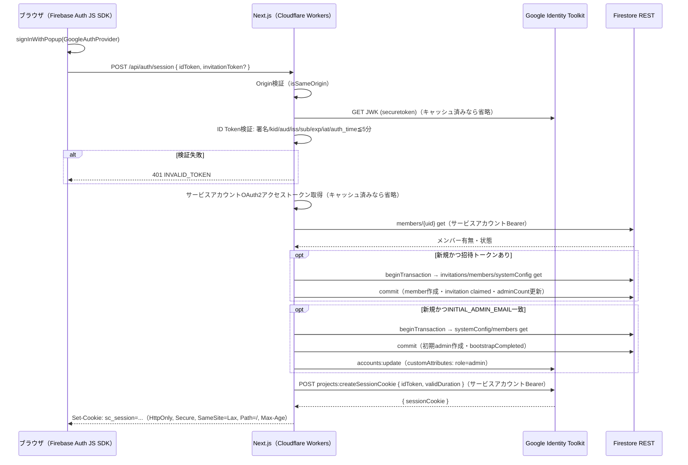
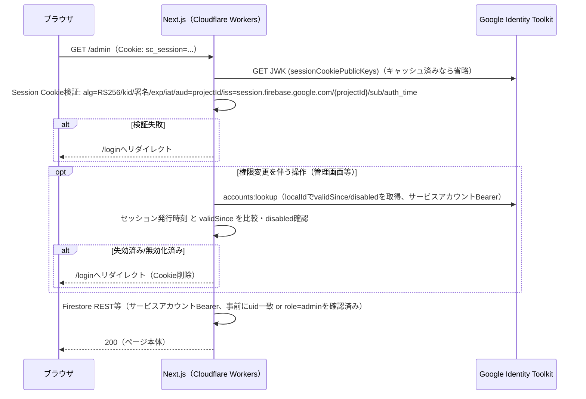
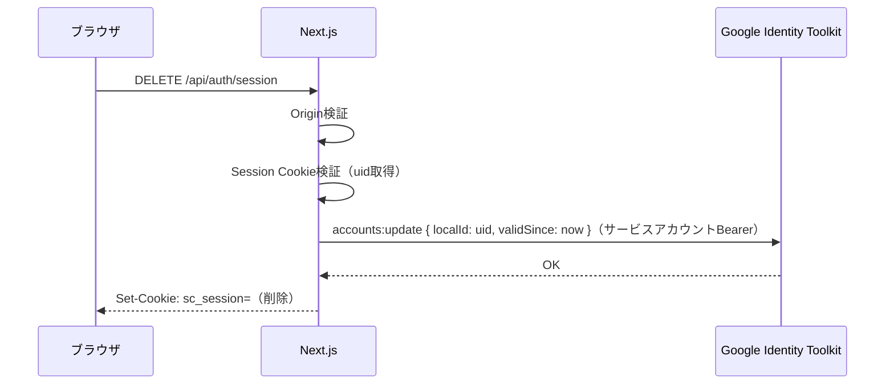

# firebase-admin REST置換設計 v2（createSessionCookie方式）

v1（`firebase-admin-inventory-and-rest-design.md`）からの変更点:
- セッション方式を「リフレッシュトークンCookie」案から、公式`projects.createSessionCookie` REST APIを使う方式に変更（v1の提案を撤回）。既存のFirebase Session Cookie形式・Cookie名・有効期限・全端末ログアウト機能を完全維持する。
- Firestore認可方針を明記: **全操作をサービスアカウントOAuth2で実行**（現行アーキテクチャを維持）。「一般ユーザー本人の操作にID Tokenを使う」案は、現行firestore.rulesがdeny-allでありルール変更が禁止事項のため不採用（ユーザー確認済み）。認可はこれまで通りサーバーコード側の事前チェック（セッション検証＋uid一致／管理者判定）で担保する。

---

## 1. 確認済みのREST仕様

| 用途 | エンドポイント | 認証 | 形式 |
|---|---|---|---|
| サービスアカウントOAuth2トークン取得 | `POST https://oauth2.googleapis.com/token`（`grant_type=urn:ietf:params:oauth:grant-type:jwt-bearer`） | JWT assertion（RS256自己署名） | — |
| ID Token検証鍵 | `GET https://www.googleapis.com/service_accounts/v1/jwk/securetoken@system.gserviceaccount.com` | 不要（公開） | JWK |
| Session Cookie検証鍵 | `GET https://identitytoolkit.googleapis.com/v1/sessionCookiePublicKeys` | 不要（公開） | JWK |
| Session Cookie発行 | `POST https://identitytoolkit.googleapis.com/v1/projects/{projectId}:createSessionCookie`（body: `{idToken, validDuration}`） | サービスアカウントBearer（scope: `identitytoolkit` または `cloud-platform`） | JSON |
| ユーザー無効化・claims・トークン失効 | `POST https://identitytoolkit.googleapis.com/v1/projects/{projectId}/accounts:update`（body: `localId`+`disableUser`/`customAttributes`/`validSince`） | サービスアカウントBearer | JSON |
| Firestore get/query/count | `https://firestore.googleapis.com/v1/projects/{projectId}/databases/(default)/documents...` | サービスアカウントBearer（scope: `datastore`） | JSON |

ID Tokenとsession Cookieは**発行者(iss)も検証鍵セットも別物**であり、両方を正しく使い分ける（v1調査時に確認済みの重要な区別）。

---

## 2. シーケンス図

### 2-1. ログイン（Session Cookie発行）

### 2-2. 認証必須ページ（Session Cookie検証）

### 2-3. ログアウト（全端末無効化）

---

## 3. Firestore認可方針（確定）

- **全てのFirestore REST呼び出しはサービスアカウントOAuth2で実行する**（現行のAdmin SDKと同じ信頼境界）。
- 権限確認なしに呼べる共通関数は公開しない。全ての公開関数は「呼び出し前にセッション検証結果（uid・role）を要求する」シグネチャにする（例: 第一引数に検証済みセッション情報を必須で取る等、呼び出し側が検証を飛ばせない設計）。
- IDOR防止（例: 実行履歴が本人のものか）は引き続きサーバーコードで`userId`一致を確認する。
- 管理者操作は`requireAdmin`相当のチェック（role=admin かつ accountStatus=active、ADMIN_EMAIL_ALLOWLIST設定時はメール一致も）を各API呼び出し前に必須で通す。

---

## 4. Transaction再現方針

Firestore REST: `POST .../documents:beginTransaction` → 対象docを`documents:get`（`transaction`パラメータ指定）→ `POST .../documents:commit`（`transaction`指定、`writes`配列）。

対象4処理（初期admin bootstrap／最後のadmin保護／招待claim／権限更新）は全てこのパターンで実装する。

- **競合時（ABORTED / gRPC相当の409）**: 上限付き指数バックオフで再試行（例: 最大5回、100ms→200ms→400ms→800ms→1600ms＋ジッター）。上限到達で失敗を呼び出し元へ返す（無限リトライしない）。
- **commit成功後にレスポンス喪失**: 冪等性を書き込み内容側で担保する設計を踏襲する（例: 招待claimは`status`の状態遷移チェックで二重適用を防止済み、実行ログは決定論的doc ID `logDocId()`で重複書き込みを防止済み）。REST化にあたり、この冪等性設計は変更しない。
- **必須の並行テスト**（ユーザー指定通り）:
  1. 管理者0人の状態で同時に2件の初回ログイン → adminが1人だけ作成されること
  2. 管理者2人を同時に無効化 → 最後の1人は保護されること
  3. 同一招待コードの同時claim → 1回だけ有効化されること
  4. 同一ユーザーへの同時権限更新 → 競合後も整合した最終状態になること
  5. transaction途中の通信失敗 → 部分適用が残らないこと
  6. commit成功後にレスポンスだけ失われたケース → 呼び出し側の再試行が二重適用を起こさないこと

---

## 5. セキュリティ実装事項（横断）

- 状態変更API（POST/DELETE/Server Action）は既存の`isSameOrigin`（Origin/Host検証）を維持・全箇所に適用。
- サービスアカウント秘密鍵・OAuth2アクセストークン・ID Token・Session Cookieの値はいかなるログ・エラーメッセージにも出力しない（`console.log`・例外メッセージ・監査ログの`beforeData`/`afterData`に混入しないよう明示的に除外）。
- OAuth2アクセストークンは有効期限（1時間）より前に更新するメモリキャッシュとする（例: 残り5分でリフレッシュ）。
- クライアントへ返すエラーはFirebase/Google APIの生レスポンスをそのまま返さず、既定のメッセージ（`REASON_MESSAGE`相当）に正規化する。
- 管理操作の監査ログ（`adminAuditLogs`）は現行通り維持・fail-closed（監査ログが書けない変更は成立させない）。
- 環境変数はCloudflare Secrets（`wrangler secret put`）で登録し、`wrangler.jsonc`に平文で書かない。

---

## 6. 実装順序（ユーザー指定通り、各段階でpreview検証を実施し合格後に次へ）

1. サービスアカウントOAuth2アクセストークン取得
2. ID Token検証
3. `projects.createSessionCookie`呼び出し
4. Session Cookie検証
5. ログイン・ログアウト
6. 一般ユーザー向けFirestore REST（get/query、サービスアカウント統一）
7. 管理者向けFirestore REST（同上、count集計含む）
8. Transaction
9. カラー化実行履歴（batched write）
10. 管理画面（一覧・検索・監査ログ）
